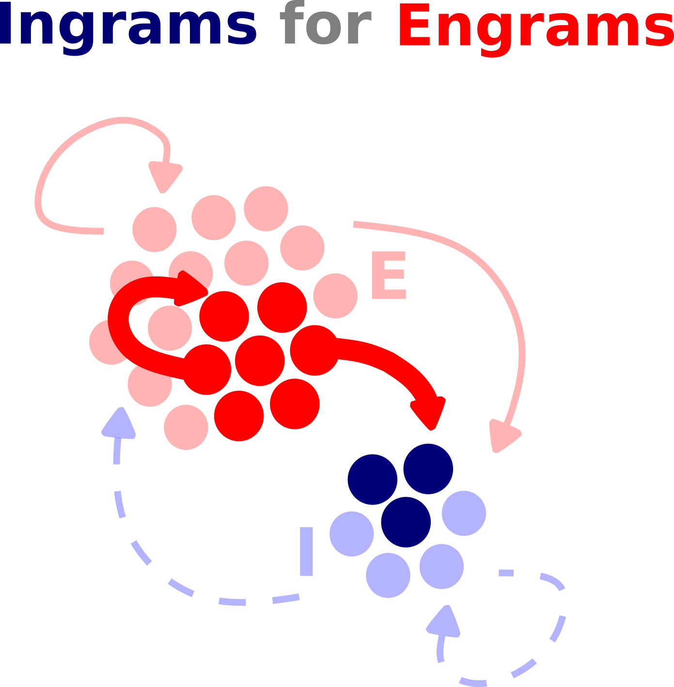

<h1>
  
  Ingrams for engrams
</h1>


## Co-active inhibitory-inhibitory plasticity shapes inhibitory assemblies that stabilize and recall embedded engrams through disinhibition

Companion code to Kania, Confavreux, and Vogels 2026 (biorxiv) Ingrams for engrams. 
This repository reproduces the main and supplementary figures and includes the network simulation scripts used to generate the underlying data.

## Repository structure

```
.
├── fig_1_s1_s2.ipynb      # Fig. 1, S1, S2  — co-active stability
├── fig_2.ipynb            # Fig. 2          — dual recall
├── fig_3_s3.ipynb         # Fig. 3, S3      — E/I assembly weights
├── fig_4_5_s4.ipynb       # Fig. 4, 5, S4   — pattern completion
├── fig_6_7.ipynb          # Fig. 6, 7       — pattern separation
├── fig_8_9_s5.ipynb       # Fig. 8, 9, S5   — ingram formation and prediction
│
├── networks/              # Brian2 
    ├── co-active_stability/
    ├── EI_assembly/
    ├── ingram_formation/
    ├── pattern_completion/
    └── pattern_separation/

```
## Environment setup

Create the environment with conda:

```bash
conda env create -f ingrams_env.yaml
conda activate ingrams
```
## Data

Data to reproduce the results will be archived on Zenodo (DOI: 10.5281/zenodo.20764012) upon final publication.
Raw simulation files are archived at ISTA servers.

## Citation

1) Kania, Confavreux, and Vogels 2026 (biorxiv) Ingrams for engrams
2) Stimberg, Marcel, Goodman, Dan F.M., & Brette, Romain. (Sep 4, 2020). Brian 2 (Version 2.4). Zenodo. doi: 10.5281/zenodo.4015226
